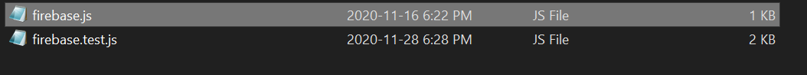

# ExData
A web application tool that takes in multiple lab reports in Word .docx and compiles it into a single Excel worrkbook .xlsx with multiple sheets.

## How to run?

### Step 1
Clone this repository into your local workspace by opening command prompt and typing in
```bash
git clone https://github.com/cdcorro/ExData.git
```

Then change your directory to the cloned repo.
```bash
cd ExData
```

### Step 2
Under ./src, create a new folder called services like so.


### Step 3
In the newly created folder, add a new file called "firebase.js" like so, which contains the tokens for Firebase.



You can either make your own, or contact Nitin at rames11a@uwindsor.ca or Bilal at sohailb@uwindsor.ca for the tokens for this project.

### Step 4
Once you have completed the steps listed above, go back to the root folder on your command prompt, and enter the following commands.
```bash
npm install
npm start
```
to run the React app on your local machine.
